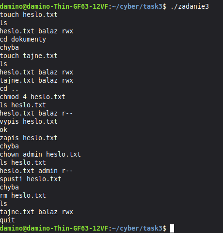

# Mini Linux Filesystem Simulator (C)

School project for a systems programming course, written in C. It simulates a very simplified Linux-like filesystem and shell, running entirely in memory (no real files touched on disk). Source code isn't included here because of the school's originality checker, this repo is just screenshots and an explanation of how it works.

## What it does

It's basically a tiny interactive shell where you type commands and it manages a fake filesystem tree in memory. Supports:

- `ls` - list contents of current directory (or a specific file/folder)
- `mkdir <name>` - create a directory
- `touch <name>` - create a file
- `rm <name>` - remove a file or directory
- `cd <name>` - change directory (also handles `..` and going back to root)
- `vypis <name>` - read/"cat" a file (checks read permission first)
- `zapis <name>` - write to a file (checks write permission first)
- `spusti <name>` - "execute" a file (checks execute permission first)
- `chmod <permissions> <name>` - change permissions on a file/folder
- `chown <new_owner> <name>` - change owner of a file/folder
- `quit` - exit

## How permissions work

Each file/directory has an owner and a permission value, same idea as Unix rwx (read/write/execute), stored as a bitmask (4 = read, 2 = write, 1 = execute). Every command checks permissions before doing anything, so if a directory doesn't have write access, `mkdir`/`touch`/`rm` inside it will just fail with an error instead of doing it anyway.

## Structure

Everything is stored as a tree in memory, each node (file or directory) knows its parent and has a fixed-size array of children. Root is created on startup, current directory pointer moves around as you `cd`. When you `rm` something, it recursively frees the whole subtree if it was a directory with stuff in it.

## Why I built it this way

The point of the assignment was to practice working with tree data structures and pointers in C, plus simulate how permission checks work on a real filesystem (which ties in with why permission bits/ACLs matter for security - if you don't check permissions before every operation, you basically have no access control at all).

## Screenshots

## Notes

Built as a school assignment, source isn't public due to the course's plagiarism/originality checks. Happy to walk through the logic or design decisions in more detail if asked (e.g. in an interview).
